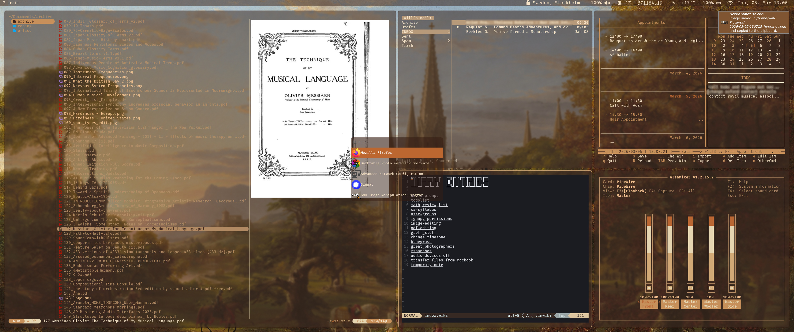

# dotfiles

This repository contains configuration files for my Arch x Hyprland rice.  
It is a highly minimalistic, themed, and keyboard/CLI-centric setup using the Hyprland tiling window manager.

I chose Arch (btw) because it is the most frictionless and least bloated distro I've tried.  
Ideally, I’d love to use NixOS for its declarative approach, but I find it too painful to customize.  

Initially, I began working on this purely for aesthetic reasons, but after using it daily for several months, it has become increasingly efficient too.
I expect many refinements to be necessary in the coming months if it is to truly replace my mac for all (but audio) tasks.

## 2026 To-do list

- [ ] Use pywal for all colors (dunst, hypr, kitty, neovim, waybar, wofi, etc.)  
- [ ] Create a quick hyprpaper script with pywal integration  
- [ ] Fix sample rate issues with audio interface  
- [ ] Cache curl requests to handle temporary website outages (wttr.in and rate.sx waybar modules)  
- [ ] Implement a recent notifications view integrated with waybar  

This project is a work-in-progress. Accompanying scripts can be found in this repo: https://github.com/william-saul/scripts
